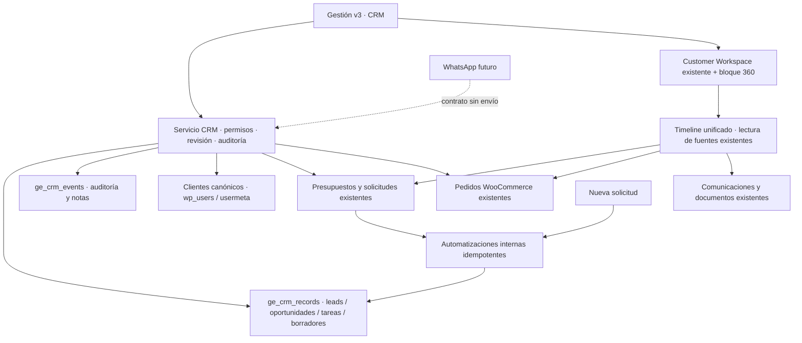

# Graphex CRM v1 · decisión y arquitectura

Fecha: 2026-10-03. Auditoría acotada a seis proyectos; fuentes oficiales. Decisión: construir un módulo nativo sobre WordPress/WooCommerce y Gestión v3. No instalar otro CRM ni sincronizar una segunda base operativa. Se reutilizan ideas de modelado, no código de terceros.

## Referencias examinadas

| Proyecto | Licencia / stack | Modelo, UX, comunicaciones y extensibilidad | Encaje en Graphex |
|---|---|---|---|
| [Krayin](https://github.com/krayin/laravel-crm) | MIT; Laravel/Vue, PHP ≥8.3 | Lead relacionado con persona, responsable, origen, pipeline y etapa; valor, actividades, emails, presupuestos y tags. Arquitectura modular. Email parsing vía SendGrid; API REST, SaaS y WhatsApp mediante extensiones que requieren evaluación independiente. Equipos/usuarios no prueban aislamiento multitenant. | Referencia principal para relaciones y ventas. Adoptar la aplicación exigiría otro runtime y migrar/sincronizar entidades existentes. |
| [Twenty](https://github.com/twentyhq/twenty) | Principalmente AGPLv3; partes comerciales y paquetes MIT según [LICENSE](https://github.com/twentyhq/twenty/blob/main/LICENSE). TypeScript, React, NestJS, PostgreSQL/Redis | Personas, empresas y oportunidades; objetos/vistas configurables, actividades y workflows con disparadores manuales, registros, cron y webhook. Workspace, API y extensibilidad; canales externos requieren sus conectores. | Referencia principal de vistas y configuración. Demasiada plataforma adicional para este v1. No se presupone WhatsApp nativo ni trasladan licencias comerciales. |
| [EspoCRM](https://github.com/espocrm/espocrm) | AGPLv3; PHP ≥8.3, SPA, REST, MySQL/MariaDB/PostgreSQL | Contacts/accounts/leads/opportunities, etapas, tareas, reuniones y correo. Metadatos configurables y equipos/ACL. [Workflows](https://docs.espocrm.com/administration/workflows/) pertenecen a Advanced Pack. Integraciones externas requieren módulos. | Tercera referencia para actividades y relaciones. Instalación separada y licencias/extensiones agregan complejidad. |
| [SuiteCRM](https://github.com/SuiteCRM/SuiteCRM) | AGPLv3; PHP/LAMP | Accounts, contacts, leads, oportunidades, actividades, correo y API; roles/equipos y workflows AOW. Versiones 7 y 8 tienen diferencias: no se asume paridad ni WhatsApp incluido. Ecosistema maduro; extensiones y personalización amplias. | Útil como comprobación de amplitud funcional. No justifica introducir otra aplicación/base para duplicar el flujo comercial. |
| [Monica](https://github.com/monicahq/monica) | AGPLv3; Laravel/PHP/MySQL; rama estable 4.x frente a main beta | CRM de relaciones personales: contactos, notas, actividades, tareas, recordatorios, API e import/export. No constituye un motor de pipeline empresarial, inbox omnicanal o automatizaciones de ventas equivalente. | Referencia ligera de continuidad de contacto; no motor para este proyecto. |
| [Frappe CRM](https://github.com/frappe/crm) | AGPLv3; Python/Frappe + Vue | Leads/deals, kanban, actividades, comentarios y tareas, API del framework, extensiones e integración ERPNext. Telefonía Twilio/Exotel; WhatsApp mediante aplicación separada. El aislamiento depende del despliegue por site y permisos, no de añadir un organization_id. | Buen patrón de bandeja y acciones contextuales. Exige incorporar un segundo framework/plataforma. |

Las seis alternativas tienen repositorios públicos activos y arquitecturas utilizables como referencia. No se hizo benchmarking, pentest ni prueba de instalación de cada una: la decisión depende del encaje con el sistema real. Producción usa PHP 7.4.33; los requisitos modernos de varios candidatos y la identidad de clientes ya existente refuerzan la implementación nativa. La antigüedad del runtime queda como deuda de infraestructura existente.

## Arquitectura efectiva

Dos tablas nuevas en la misma base WordPress. Los registros comerciales existentes conservan sus identificadores, repositorios y flujos. Relaciones CRM con customer_id, lead_id, opportunity_id, quote_id y order_id indexadas; quote_request_id y communication_id validadas en el payload. Proveedores rechazados hasta disponer de un adaptador con alcance por organización. Las notas/tareas/historial nuevo se auditan; cotizaciones, pedidos, pagos, archivos y email se leen en vivo.

La integración es aditiva: loader MU, servicio, UI, wrapper del shell original y assets propios. No se sobrescribe Gestion v3 ni sus templates compartidos. Se sustituye únicamente la región main y se comprueba su existencia; cambios incompatibles del shell producen un fallo explícito. Navegación, búsqueda y Customer 360 se anexan al DOM actual. La UI requiere JavaScript para esas extensiones; los formularios comerciales funcionan mediante admin-post con nonce.

## Seguridad y alcance SaaS

Todas las consultas CRM llevan organization_id; no se aceptan IDs de organización proporcionados por el cliente. El contexto operativo actual es la organización primaria de Foundation (`graph-express`). Se verifican membresía activa, módulo y rol en servidor, incluso para administradores WordPress. Un usuario/cliente o presupuesto explícitamente marcado para otra organización queda excluido. Los datos legacy sin marca sólo se admiten en la instancia principal con validación del cliente.

| Rol Foundation | CRM |
|---|---|
| owner/admin | Lectura, escritura, configuración, import y automatizaciones |
| comercial/staff | Leads, oportunidades, tareas, borradores, notas y conversión |
| administracion/read-only | Lectura y export autorizado |
| produccion | Sin acceso comercial general; conservan su módulo existente |
| Sin membresía | Denegado aunque sea administrador WP |

No habilita multitenancy operativo de toda la instalación legacy. Foundation todavía separa configuración; el CRM está preparado con scope y validaciones, pero operar otra empresa requiere la instancia dedicada/runtime definido por el trabajo SaaS. El flag efectivo es `ge_crm_config_{organization}.enabled`, y se respeta `settings.modules.crm` cuando Foundation lo define. No se amplían capacidades WordPress para dar acceso a otros módulos.

Escrituras con bloqueo por base/organización, transacción InnoDB, revisión optimista y auditoría before/after. Conversión revisa coincidencias por email/teléfono/CUIT; exige elección explícita cuando existen, y reutiliza el usuario canónico. No envía invitaciones. CSV crea leads para revisar y convertir, nunca clientes duplicados automáticamente. Export neutraliza fórmulas.

## Automatizaciones y canales

Nueva solicitud → lead + tarea interna idempotente. Presupuesto enviado → etapa correspondiente; convertido en pedido → ganado. Revisión diaria o manual genera tareas de seguimiento e inactividad. No existe un engine genérico ni envío externo.

Comunicaciones existentes permanece como bandeja de email del sistema; CRM agrega asociaciones y borradores revisables. Las respuestas rápidas se consultan desde el módulo activo cuando existe o desde la referencia versionada autorizada. Variables pendientes impiden aprobar un borrador. Aprobar registra usuario/fecha y deja delivery=not_sent.

## Límites y próximos adaptadores

Vistas iniciales: 100 registros en listas, 500 oportunidades en kanban, 100 opciones comerciales, 50 logs email; export recorre todas las páginas. Import: 200 filas / 512 KiB. La revisión diaria inicial recorre 500 oportunidades recientes. Escalar requiere paginación y ejecución por lotes; los contadores del dashboard usan agregación completa.

Formulario web/landing y email entrante pueden cargar mediante el contrato autenticado; no se instaló un receptor público ni un parser de correo. Portal se vincula por solicitudes actuales y fuentes del historial; no se inventa un stream de eventos que el sistema no publica. WhatsApp real requiere conector, credenciales, verificación de webhook, consentimiento y entrega trazable; IA requiere modelo de clasificación/sugerencia y evaluación. Ambas quedan fuera del envío de v1 por instrucción explícita.
